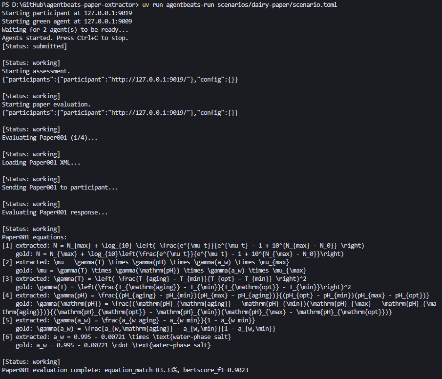
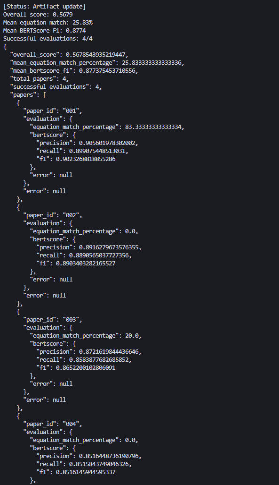
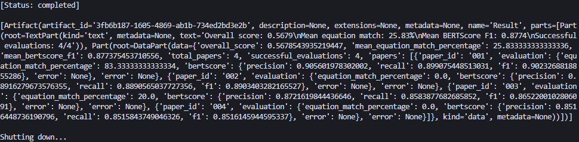

# AgentBeats Paper Extractor

A paper extraction evaluation scenario that tests how well agents can extract structured information from dairy science papers. The scenario includes a green agent (evaluator) and a purple agent (participant) that work together to assess paper extraction capabilities.

## What It Does

This project evaluates agents' ability to extract structured information from scientific papers:

- **Green Agent** (`paper_evaluator.py`): Orchestrates the evaluation by:
  - Loading dairy science papers from XML files
  - Sending papers to participant agents for extraction
  - Evaluating extracted content against gold-standard references
  - Computing metrics including BERTScore (precision, recall, F1) and equation matching
  - Producing detailed evaluation reports

- **Purple Agent** (`paper_agent.py`): Participates in the evaluation by:
  - Receiving paper XML content and extraction templates
  - Using an LLM to extract structured information (metadata, equations, key findings)
  - Returning structured JSON responses

- **Scenario**: The complete evaluation setup that runs multiple papers through the evaluation pipeline and aggregates results.

## Sample Outputs







## Quickstart

### Prerequisites

1. Clone the repository:
```bash
git clone <your-repo-url>
cd agentbeats-paper-extractor
```

2. Install dependencies:
```bash
uv sync
```

**Note:** If you see a warning about hardlinking files (common on Windows when cache and target are on different filesystems), you can suppress it by setting:
```powershell
$env:UV_LINK_MODE="copy"
```
Or use the flag: `uv sync --link-mode=copy`

3. Set up environment variables:
```bash
cp sample.env .env
```

Edit `.env` and add your API keys:
- `OPENAI_API_KEY`: Required for the purple agent (or set `PURPLE_MODEL` to use a different provider via litellm)
- Other API keys as needed for your LLM provider

### Running Agents Manually

You can run the agents separately in different terminals:

#### Run the Green Agent (Evaluator)

```bash
python scenarios/dairy-paper/paper_evaluator.py --host 127.0.0.1 --port 9009
```

The green agent will:
- Start an A2A server on the specified host and port
- Wait for assessment requests
- Process papers when an assessment is initiated

**Environment variables:**
- `INPUT_DIR`: Directory containing paper XML files (default: `scenarios/dairy-paper/data/input`)
- `OUTPUT_DIR`: Directory containing gold-standard JSON outputs (default: `scenarios/dairy-paper/data/output`)
- `TEMPLATES_DIR`: Directory containing extraction templates (default: `scenarios/dairy-paper/templates`)
- `PARTICIPANT_TIMEOUT`: Timeout in seconds for participant requests (default: 300)

#### Run the Purple Agent (Participant)

```bash
python scenarios/dairy-paper/paper_agent.py --host 127.0.0.1 --port 9019
```

The purple agent will:
- Start an A2A server on the specified host and port
- Accept paper extraction requests from the green agent
- Use the configured LLM to extract structured information
- Return JSON responses

**Arguments:**
- `--host`: Host address to bind (default: `127.0.0.1`)
- `--port`: Port to bind (default: `9019`)
- `--card-url`: External URL for the agent card (optional)
- `--agent-llm`: LLM identifier for litellm (default: uses `PURPLE_MODEL` env var or `openai/gpt-5.2`)

**Environment variables:**
- `PURPLE_MODEL`: LLM model identifier (e.g., `openai/gpt-5.2`, `openai/gpt-5.2-mini`, `anthropic/claude-3.5-haiku`)
- `OPENAI_API_KEY`: API key for the LLM provider (or set provider-specific keys for litellm)

### Running the Complete Scenario

Once you understand how to run the agents individually, you can run the entire scenario (which starts both agents and executes the evaluation automatically):

```bash
uv run agentbeats-run scenarios/dairy-paper/scenario.toml
```

This command will:
- Start the green agent server on `http://127.0.0.1:9009`
- Start the purple agent server on `http://127.0.0.1:9019`
- Send an assessment request to the green agent
- Process all papers (Paper001-Paper004) through the evaluation pipeline
- Display evaluation results including BERTScore metrics and equation matching

**Options:**
- `--show-logs`: Show detailed agent logs during execution
- `--serve-only`: Start the agents but don't run the assessment (useful for manual testing)

Alternatively, if you've already started the agents manually in separate terminals, you can trigger an assessment using:

```bash
uv run agentbeats-run scenarios/dairy-paper/scenario.toml
```

Or use the A2A client directly to send an assessment request to the green agent.

## Docker Images & Publishing

- Purple agent: `ghcr.io/chenhaoq87/agentbeats-paper-extractor-paper-agent:<tag>`
- Green agent: `ghcr.io/chenhaoq87/agentbeats-paper-extractor-paper-evaluator:<tag>`
  - GitHub Actions publishes `latest` on pushes to `main`, and semantic tags (`1.0.0`, `1`) when you push git tags like `v1.0.0`.

### Build & push automatically (GitHub Actions)
1. Commit and push to `main`, or create a tag:
   ```bash
   git tag v1.0.0
   git push origin v1.0.0
   ```
2. Workflow `.github/workflows/publish.yml` builds for `linux/amd64` and pushes both images to GHCR.
3. Find images under the repository “Packages” section; adjust visibility there.

### Build locally (optional)
```bash
# From repo root
docker build --platform linux/amd64 -f scenarios/dairy-paper/Dockerfile.paper-agent -t ghcr.io/chenhaoq87/agentbeats-paper-extractor-paper-agent:local .
docker build --platform linux/amd64 -f scenarios/dairy-paper/Dockerfile.paper-evaluator -t ghcr.io/chenhaoq87/agentbeats-paper-extractor-paper-evaluator:local .
```

### Run pulled images
```bash
# Purple agent
docker run --rm -p 9019:9019 \
  -e OPENAI_API_KEY=your_key \
  -e PURPLE_MODEL="openai/gpt-5.2" \
  ghcr.io/chenhaoq87/agentbeats-paper-extractor-paper-agent:latest \
  --host 0.0.0.0 --port 9019

# Green agent
docker run --rm -p 9009:9009 \
  ghcr.io/chenhaoq87/agentbeats-paper-extractor-paper-evaluator:latest \
  --host 0.0.0.0 --port 9009
```

### CI secrets
- `OPENAI_API_KEY` (for assessment workflow)
- `GHCR_TOKEN` (only if needed; `publish.yml` uses `GITHUB_TOKEN` for GHCR)

## Project Structure

```
src/
└─ agentbeats/
   ├─ green_executor.py        # base A2A green agent executor
   ├─ models.py                # pydantic models for green agent IO
   ├─ client.py                # A2A messaging helpers
   ├─ client_cli.py            # CLI client to start assessment
   └─ run_scenario.py          # run agents and start assessment

scenarios/
└─ dairy-paper/                # paper extraction evaluation scenario
   ├─ helpers.py               # shared utilities and scoring helpers
   ├─ paper_agent.py           # purple agent (participant)
   ├─ paper_evaluator.py       # green agent (evaluator)
   ├─ scenario.toml            # scenario configuration
   ├─ data/
   │  ├─ input/                # input paper XML files
   │  └─ output/               # gold-standard JSON outputs
   └─ templates/               # extraction templates
```

## Evaluation Metrics

The green agent evaluates purple agent responses using:

1. **BERTScore**: Semantic similarity metrics (precision, recall, F1) comparing extracted text against gold-standard references
2. **Equation Matching**: Exact matching of mathematical equations extracted from papers
3. **Structured Field Extraction**: Validation of required JSON fields and structure

Results are aggregated across all papers and reported as JSON artifacts.

## Configuration

The scenario configuration is defined in `scenarios/dairy-paper/scenario.toml`:

```toml
[green_agent]
endpoint = "http://127.0.0.1:9009"
cmd = "python scenarios/dairy-paper/paper_evaluator.py --host 127.0.0.1 --port 9009"

[[participants]]
role = "participant"
endpoint = "http://127.0.0.1:9019"
cmd = "python scenarios/dairy-paper/paper_agent.py --host 127.0.0.1 --port 9019"

[config]
# Empty config - paper IDs are hardcoded in the agent
```

You can modify endpoints, ports, or add additional participants as needed.
